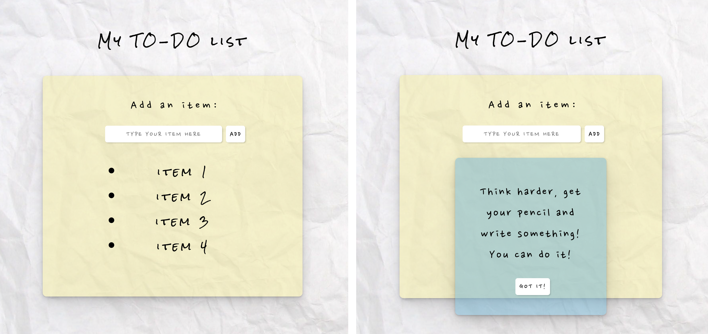

## TO-DO List

 

This is a simple React project aimed to stengthen basic React principles.

 

- React project instalation

- component creation

- JSX

- styling (dyanimc styles)

- props

- state management (useState hook, lifting up state)

- handling lists

- conditional content

- modal window

- validation & reset

- input management

- debugging

  

---

 

[Try writing your own post-it!](https://emarekica-react-todo-list.netlify.app)

 

---

 

## Mockup

 

  

---

 

## Improvements

 

[ ] Add check box next to each item to remove it >> doesn't remove it, but **strikes it**

[ ] add button to make a new list (reloads the page)

[x] add favicon

[x] check error modal CSS in queries

- smaller font in modal in mobile mode + make the container wider (horrible on Firefox)
- in mobile, the GOT IT button to exit the error modal is invisible + not working
- make error modal container not overlap with the input field

[ ] implement SCSS

[ ] Add [password validation](https://stackoverflow.com/questions/12090077/javascript-regular-expression-password-validation-having-special-characters)

  
